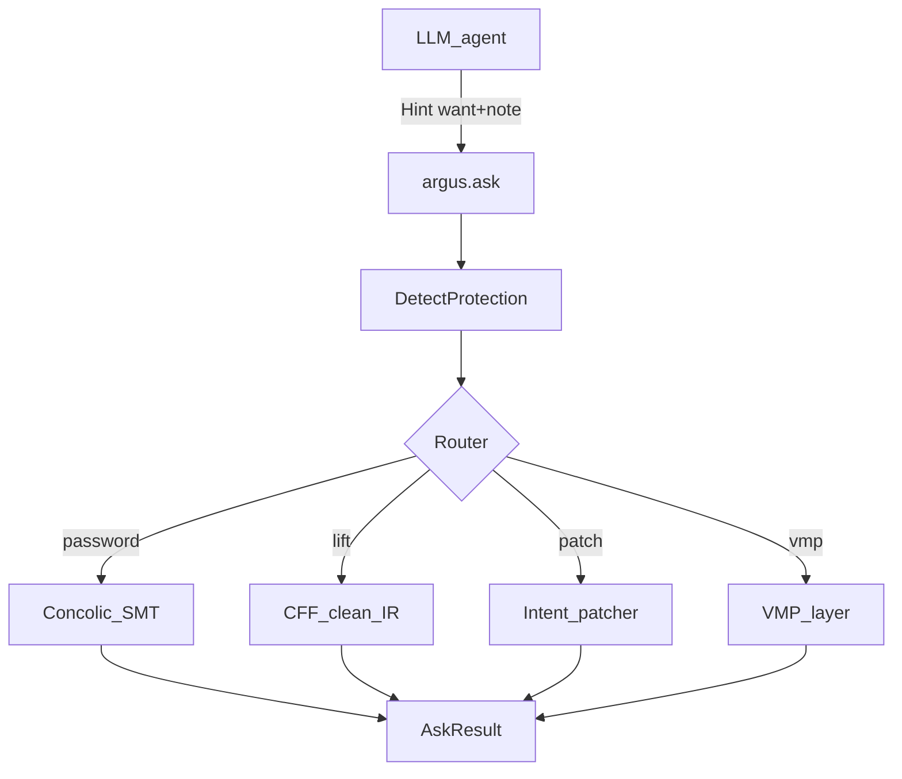

# Argus 0.2.0 — mega plan

## Продуктовая рамка

**Контракт с ИИ (уже есть, усиливается):** модель даёт `Hint` (`want` + свободный `--hint`), пайплайн возвращает `answer` | `readable` | `patched_path` + certificate. Не «сканируем папку паттернами вместо ИИ» — ИИ рулит intent’ом, Argus доказывает и исполняет.

**Честный «~90%» для 0.2.0:** публичный OLLVM/CTF-подобный корпус (ELF+PE CFF/MBA/BCF) + plain crackmes + простые packers (UPX). VMP: **частичная** девирт на `sample1`/`adder`, не ultrasec/Themida full.

Версия: bump `0.1.0` → `0.2.0` в [`argus/__init__.py`](argus/__init__.py) + [`pyproject.toml`](pyproject.toml) после закрытия DoD ниже.

---

## Wave A — Ask 2.0 (LLM surface)

Расширить [`argus/ask.py`](argus/ask.py) и CLI `argus ask`:

| want / patch_kind | Поведение 0.2.0 |
|-------------------|-----------------|
| `password` | auto deobf→concolic→verify; `answer` = секрет |
| `lift` | не сырой asm-dump, а **псевдо-C / cleaned CFG** после unflatten+MBA |
| `patch always_true/false` | уже есть stub; + verify «Welcome без пароля» |
| `patch nop_prompts` | стабилизировать |
| `patch skip_check` | NOP/force jcc по якорю из hint (`strcmp` site / addr) |
| `deobf` | multi-fn CFF + optional MBA/bogus |
| NEW `want=ir` | JSON IR блоков для модели (компактнее lift) |

Добавить `AskResult.tool_schema` / короткий JSON Schema в docs для агентов Cursor.

DoD A: один tool-call от агента закрывает fauxware / fauxware_fla / always_true bypass без ручного CLI.

---

## Wave B — Concolic engine (скорость + охват)

Сейчас: лёгкий symbolic [`argus/symbolic/engine.py`](argus/symbolic/engine.py) + заготовка Unicorn [`argus/concrete/runner.py`](argus/concrete/runner.py).

Сделать **concrete-until-branch**:

1. Unicorn гонит конкретно до первого symbolic-зависимого jcc / strcmp.
2. Fork только там; Z3 на path constraints.
3. Богаче libc hooks: `read`, `fgets`, `scanf`, `strlen`, `memcmp`, `printf` formats (минимально).
4. Seed из hint (`--hint` парсит «password length 8» / «stdin = user\\npass» — простой NLP-lite / regex, не LLM внутри Argus).

Hot-path: убрать полный sort очереди на каждом шаге; bucket concrete-first.

DoD B: solve на OLLVM linux64 `target_function`/`main` где есть oracle; runtime unflatten+solve функции ~1–5k блоков — секунды, не минуты.

---

## Wave C — OLLVM «класс закрыт» (ELF+PE)

Усилить [`argus/deobf/unflatten.py`](argus/deobf/unflatten.py), [`cff.py`](argus/deobf/cff.py), [`bogus.py`](argus/deobf/bogus.py), [`mba/`](argus/mba/):

1. **PE x64 CFF** unflatten+patch на `samples/ollvm/CFF_win64*.exe` (сейчас в основном load/CFG).
2. Switch/jmp-table dispatcher recovery (не только sub/je chain).
3. MBA: вырезание из ASM в BV-expr + prove + optional rewrite.
4. Bogus-CF (`-bcf`): prove constant predicate → patch jcc с cert.
5. Corpus harness: таблица ground-truth в [`samples/MANIFEST.md`](samples/MANIFEST.md) + pytest tier «password or lift+cases≥N».

DoD C: ≥90% семплов в `samples/ollvm/*` дают либо `ask --want password` success, либо `lift` с `case_map≥N` + patched binary behavior-preserving на smoke.

---

## Wave D — VMP layer v1 (частичная девирт)

Не полный unpack ultrasec. Цель: **читаемый артефакт на tiny VMP**.

На [`samples/vmp/sample1.vmp.bin`](samples/vmp/sample1.vmp.bin), `adder.vmp.exe`:

1. Detect+section map (есть) → **stub tracer** на Unicorn (до VM enter / N blocks).
2. `VMPTraceProvider` реализация `UnicornVMPTrace` (не только Dict mock).
3. Bytecode/handler I/O сбор → существующий [`HandlerSynthesizer`](argus/deobf/vm.py).
4. `ask --want lift -f … --hint "vmp"` → readable handler summary + partial IR.
5. Explicit non-goal 0.2.0: Themida full, ultrasec crack, import rebuild всех версий VMP3.

DoD D: `ask` на `sample1`/`adder` возвращает `ok` с `readable` содержащим хотя бы 1 synthesized handler / stub map; detect стабилен на всём `samples/vmp/*`.

---

## Wave E — Packers + patch intents

1. UPX detect+`-d` orchestrate (subprocess upx) → затем обычный ask.
2. Patch library в [`argus/patch/`](argus/patch/): `always_true`, `force_branch`, `nop_call`, `ret_imm`, patch `je/jne` near — все с certificate + optional verify.
3. `want=patch` принимает якорь из hint: имя функции, VA, «strcmp success path».

DoD E: документированные рецепты bypass для тестовых ELF без ломания certificate-контракта.

---

## Wave F — Eval / corpus / release gate

1. `argus eval --corpus samples` → JSON: ms/fn, success rates by class.
2. CI-friendly: `tests/test_corpus_020.py` с маркерами `ollvm`, `vmp_partial`, `ask`.
3. README: «LLM recipe» — как агенту вызывать `ask` (не fake demos).

Release gate 0.2.0:

- Ask password: fauxware + fauxware_fla
- Ask patch always_true: verified Welcome
- OLLVM corpus ≥90% tier target
- VMP tiny: lift/handler partial
- Version 0.2.0 tagged

---

## Порядок внедрения (скорость поставки)

1. **B concolic** + **A ask ir/skip_check** — сразу больше crackme без VMP  
2. **C PE/OLLVM** — закрывает «класс OLLVM»  
3. **D VMP partial** — ответ на «а VMP?»  
4. **E packers/patches**  
5. **F eval + 0.2.0 bump**

Ключевой код: [`argus/ask.py`](argus/ask.py), [`argus/concrete/runner.py`](argus/concrete/runner.py), [`argus/symbolic/explorer.py`](argus/symbolic/explorer.py), [`argus/deobf/unflatten.py`](argus/deobf/unflatten.py), новый `argus/deobf/vmp_trace.py`, [`argus/pipeline.py`](argus/pipeline.py).

## Сознательно не в 0.2.0

- Универсальный VMProtect/Themida unpack «как коммерческий тул»
- 100% на произвольном бинаре без hint/якоря от ИИ
- Замена GNN на LLM-inside-hotpath (GNN остаётся proposer, LLM — снаружи через Hint)
